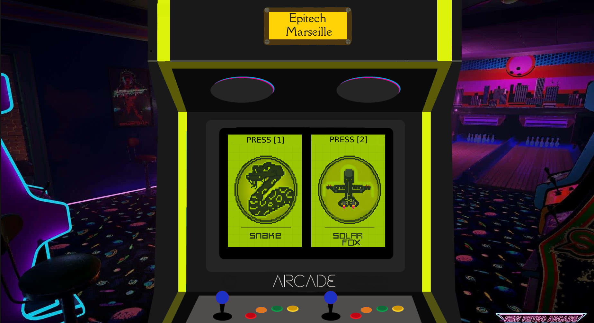

<a name="readme-top"></a>

<!-- PROJECT LOGO -->
<br />
<div align="center">
    

  <h2 align="center">ARCADE GAME</h2>

</div>

<!-- TABLE OF CONTENTS -->
<details>
  <summary>Table of Contents</summary>
  <ol>
    <li>
      <a href="#about-the-project">About The Project</a>
      <ul>
        <li><a href="#built-with">Built With</a></li>
      </ul>
    </li>
    <li>
      <a href="#getting-started">Getting Started</a>
      <ul>
        <li><a href="#prerequisites">Prerequisites</a></li>
      </ul>
    </li>
    <li><a href="#usage">Usage</a></li>
    <li><a href="#contributing">Contributing</a></li>
    <li><a href="#license">License</a></li>
  </ol>
</details>


<!-- ABOUT THE PROJECT -->
## About The Project

The ***Arcade*** project is a retro gaming platform in _C++_ with a strong focus on _Object-Oriented_ Programming. It allows users to choose from various games and graphics libraries, loading them dynamically. The project enforces a strict separation between game logic and graphics, utilizing dynamic libraries for this purpose. It emphasizes documentation and collaboration with other groups for interface compatibility.

<div align="center">
    
</div>

<p align="right">(<a href="#readme-top">back to top</a>)</p>


### Built With

All project is build with C++ and use ***SDL2*** & ***SFML*** librairie

* 

  
<p align="right">(<a href="#readme-top">back to top</a>)</p>


<!-- GETTING STARTED -->
## Getting Started

If you have all prerequisites you can follow step.You can choose to launch the game directly from the sfml or sdl library, or you can choose to launch the snake or solar fox game. You can change the game as you wish.

> Make project
```sh
$> make
```

> Start project
```sh
$> ./arcade lib/arcade_ncurses.so
```

### Prerequisites

You need to install ***SFML librairie*** and some some ***SDL2 librairie***

* SDL2
  ```sh
  $> sudo apt install libsdl2-2.0-0 libsdl2-dev
  ```

* SDL2
  ```sh
  $> sudo apt install libsdl2-ttf-dev
  ```

* SDL2
  ```sh
  $> sudo apt install libsdl2-mixer-dev
  ```

* SDL2
  ```sh
  $> sudo apt install libsdl2-image-dev
  ```

* SFML
  ```sh
  $> sudo apt install libsfml-dev
  ```


<p align="right">(<a href="#readme-top">back to top</a>)</p>


<!-- USAGE EXAMPLES -->
## Usage

If you want to change librairie in game, you just need to press ***G*** on your keyboard.

<p align="right">(<a href="#readme-top">back to top</a>)</p>


<!-- CONTRIBUTING -->
## Contributing

Contributions are what make the open source community such an amazing place to learn, inspire, and create. Any contributions you make are **greatly appreciated**.

If you have a suggestion that would make this better, please fork the repo and create a pull request. You can also simply open an issue with the tag "enhancement".
Don't forget to give the project a star! Thanks again!

1. Fork the Project
2. Create your Feature Branch (`git checkout -b feature/AmazingFeature`)
3. Commit your Changes (`git commit -m 'Add some AmazingFeature'`)
4. Push to the Branch (`git push origin feature/AmazingFeature`)
5. Open a Pull Request

<p align="right">(<a href="#readme-top">back to top</a>)</p>


<!-- LICENSE -->
## License

Distributed under the MIT License. See `LICENSE.txt` for more information.

<p align="right">(<a href="#readme-top">back to top</a>)</p>


<!-- CONTACT -->
## CREW

DEV1 -> Mohamed Mansour

DEV2 -> Raphael de Monchy

<p align="right">(<a href="#readme-top">back to top</a>)</p>
